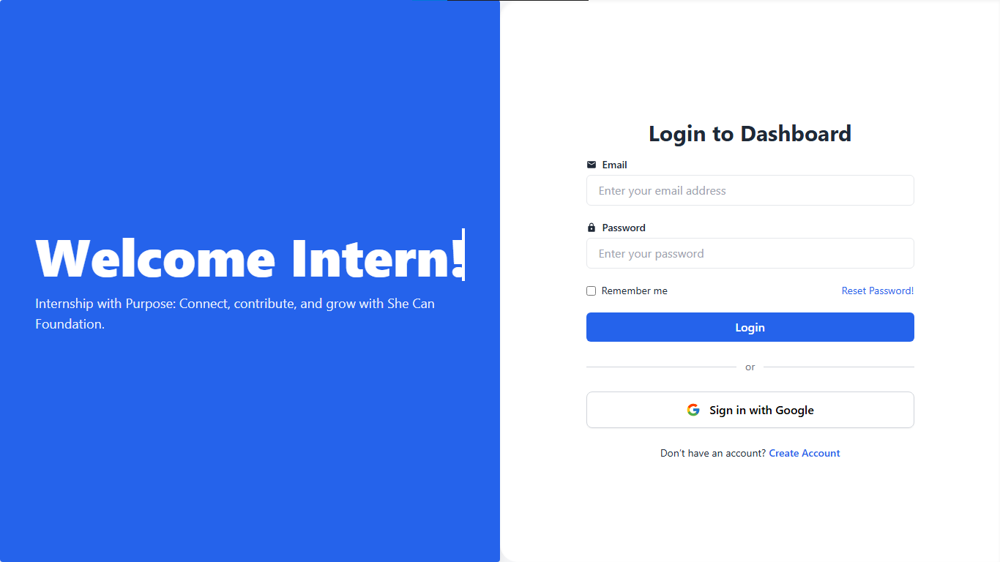
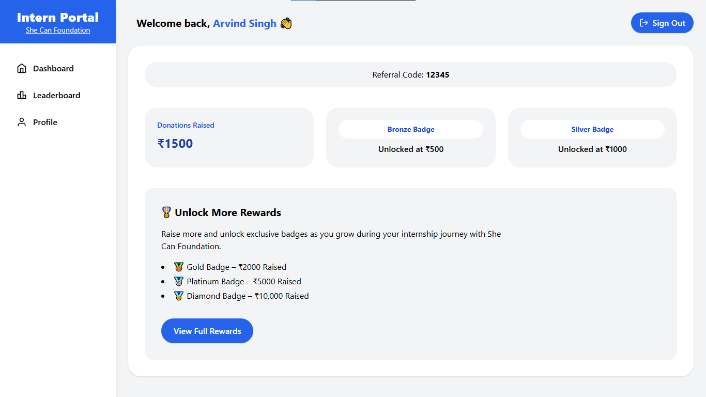
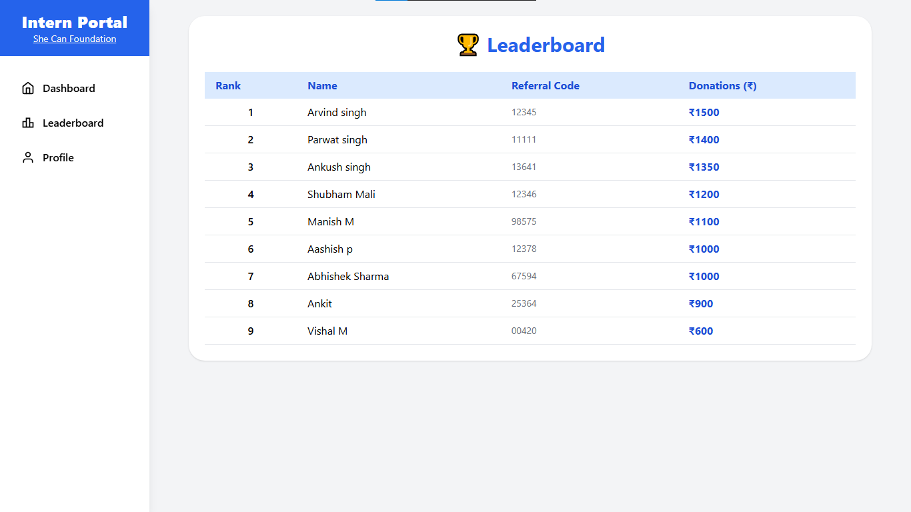
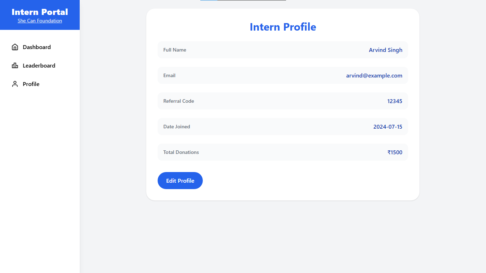

# 🌐 Intern Portal – She Can Foundation

Welcome to the **Intern Portal** – a simple, elegant, and responsive web dashboard built as part of an internship project at **She Can Foundation**.

This project demonstrates the ability to design and develop a full-stack web application using **React**, **Tailwind CSS**, and modern development practices.

---

## 🎯 Project Objective

The purpose of this Intern Portal is to:

- Provide interns with a clean, personalized dashboard experience  
- Display intern information: name, referral code, and donations raised  
- Showcase rewards and unlockables earned during the internship  
- Demonstrate frontend + backend integration using Firebase (Firestore & Authentication)

---

## ✨ Features

- 🔐 **Login & Signup Pages** with Firebase Auth (Email/Password + Google Sign-In)  
- 📊 **Dashboard** showing:
  - Intern name
  - Unique referral code (e.g., `yourname2025`)
  - Total donations raised (fetched from Firebase)
  - Rewards section based on donation milestones  
- 🏆 **Leaderboard** with data loaded from Firestore (dummy dynamic data)  
- 👤 **Profile Page** with a modern, responsive UI  
- 📱 Fully **responsive** for mobile and desktop  
- ⚡ Built using **Vite** for fast development  
- 🔐 Firebase Security Rules applied during development

---

## 🚀 Technologies Used

- [React](https://reactjs.org/) – Frontend library  
- [Tailwind CSS](https://tailwindcss.com/) – Utility-first styling  
- [React Router DOM](https://reactrouter.com/) – Routing  
- [Vite](https://vitejs.dev/) – Lightning-fast dev environment  
- [Firebase](https://firebase.google.com/) – Auth + Firestore backend  

---

## 💼 Internship Context

This project was built as part of my internship at **She Can Foundation**.  
It showcases my ability to:

- Plan & structure scalable React apps  
- Work with Firebase Authentication & Firestore  
- Build responsive, modern UIs using Tailwind CSS  
- Integrate frontend and backend data  
- Manage project UI/UX efficiently

---

## 📸 Preview

### 🔹 Login Page

### 🔹 Signup Page

### 🔹 Dashboard Page

### 🔹 Leaderboard Page

### 🔹 Profile Page

---

## 👤 Author

**Arvind Singh**  
_B.Tech CSE,

---

## ⭐ Show Your Support

If you like this project, **give it a ⭐ on GitHub** or share it to inspire others!

---

